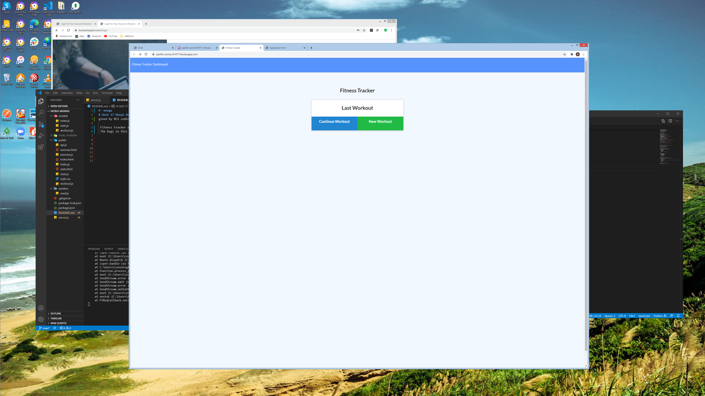

# -mongo
# Unit 17 Nosql Homework: Workout Tracker
given by BCS coding bootcamp.

 Fitness tracker app where the user can keep track of the exersises completed, allows users to add exersises,  and see their data shown via chart.
 

[this is the link to the page](https://pacific-ravine-81477.herokuapp.com/)

